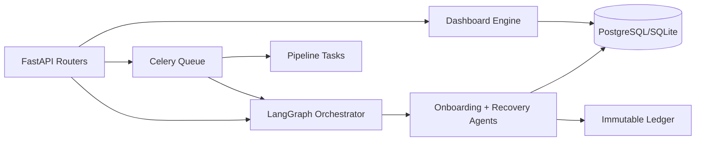
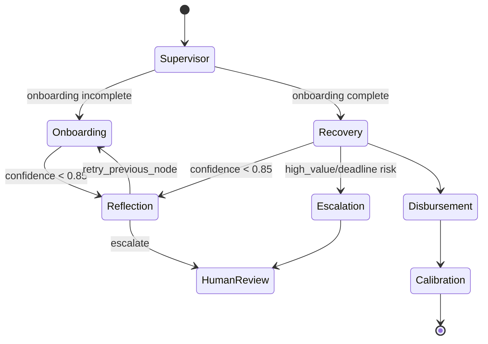
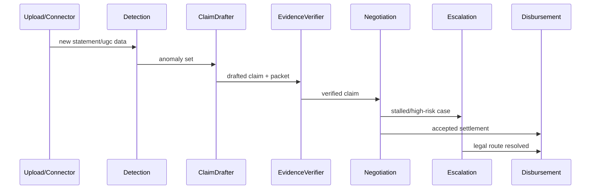

# UML and Flow Diagrams

## Component Diagram

```mermaid
flowchart LR
    API[FastAPI Routers] --> ORCH[LangGraph Orchestrator]
    ORCH --> AGENTS[Onboarding + Recovery Agents]
    AGENTS --> DB[(PostgreSQL/SQLite)]
    AGENTS --> LEDGER[Immutable Ledger]
    API --> DASH[Dashboard Engine]
    DASH --> DB
    API --> CELERY[Celery Queue]
    CELERY --> ORCH
    CELERY --> PIPE[Pipeline Tasks]
```

## Orchestrator State Machine

```mermaid
stateDiagram-v2
    [*] --> Supervisor
    Supervisor --> Onboarding: onboarding incomplete
    Supervisor --> Recovery: onboarding complete
    Onboarding --> Reflection: confidence < 0.85
    Reflection --> Onboarding: retry_previous_node
    Reflection --> HumanReview: escalate
    Recovery --> Reflection: confidence < 0.85
    Recovery --> Escalation: high_value/deadline risk
    Escalation --> HumanReview
    Recovery --> Disbursement
    Disbursement --> Calibration
    Calibration --> [*]
```

## Claim Lifecycle Sequence

```mermaid
sequenceDiagram
    participant U as Upload/Connector
    participant D as Detection
    participant C as ClaimDrafter
    participant E as EvidenceVerifier
    participant N as Negotiation
    participant X as Escalation
    participant P as Disbursement

    U->>D: new statement/ugc data
    D->>C: anomaly set
    C->>E: drafted claim + packet
    E->>N: verified claim
    N->>X: stalled/high-risk case
    N->>P: accepted settlement
    X->>P: legal route resolved
```
